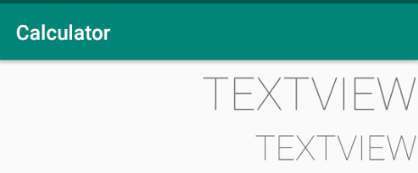
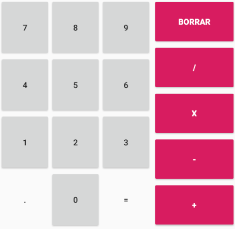

# Intruducción

En estas lecciones donde vamos a aprender acerca de los objectos de UI crearemos una calculadora para ir explicando cada sección, además como veremos mas adelante, será una calculadora personalizable.

# Diseño de la UI

Vamos a crear un nuevo pryecto empleando la **plantilla** `Empty activity`. Posteriormente añade **AndroidAnnotations**. Finalmente actualiza el **android manifest** para que se pueda lanzar el proyecto de AA.

A continuación en la vista principal añade dos `TextViews`:


- Al **primero** lo llamaremos `tv_operations` y tendrán las dimensiones que se muestran a continuación:

```
		android:layout_width="0dp"
		android:layout_height="wrap_content"
		android:layout_marginStart="1dp"
		android:layout_marginTop="1dp"
		android:layout_marginEnd="1dp"
```

&nbsp;&nbsp;&nbsp;&nbsp;&nbsp;&nbsp;&nbsp;&nbsp;- Tendrá el siguiente diseño:

```
        android:fontFamily="@font/roboto_thin"
		android:textAlignment="viewEnd"
		android:textAllCaps="true"
		android:textAppearance="@style/TextAppearance.AppCompat.Display2"
        android:maxLines="1"
		android:textStyle="bold"
        android:text="@string/initializing"
```

&nbsp;&nbsp;&nbsp;&nbsp;&nbsp;&nbsp;&nbsp;&nbsp;- Y los margenes o restricciones serán:

```
        app:layout_constraintEnd_toEndOf="parent"
		app:layout_constraintStart_toStartOf="parent"
		app:layout_constraintTop_toTopOf="parent"
```

- Respecto al **segundo**, lo llamaremos `tv_results` y tendrá las siguientes dimensiones:

```
		android:layout_width="0dp"
		android:layout_height="wrap_content"
		android:layout_marginStart="1dp"
		android:layout_marginTop="1dp"
		android:layout_marginEnd="1dp"
```

&nbsp;&nbsp;&nbsp;&nbsp;&nbsp;&nbsp;&nbsp;&nbsp;- Tendrá el siguiente diseño:

```
		android:fontFamily="@font/roboto_thin"
		android:textAlignment="viewEnd"
		android:textAllCaps="true"
		android:textAppearance="@style/TextAppearance.AppCompat.Display1"
        android:maxLines="1"
        android:text="@string/initializing"
```

&nbsp;&nbsp;&nbsp;&nbsp;&nbsp;&nbsp;&nbsp;&nbsp;- Y los margenes o restricciones serán:

```
		app:layout_constraintEnd_toEndOf="parent"
		app:layout_constraintStart_toStartOf="parent"
		app:layout_constraintTop_toBottomOf="@+id/tv_operations"
```

El resultado debería ser como la captura que se muestra a continuación:



Ahora vamos a añadir los siguientes **recursos** de tipo String:

```
    <string name="initializing">Initializing…</string>

    <string name="number_1">1</string>
    <string name="number_2">2</string>
    <string name="number_3">3</string>
    <string name="number_4">4</string>
    <string name="number_5">5</string>
    <string name="number_6">6</string>
    <string name="number_7">7</string>
    <string name="number_8">8</string>
    <string name="number_9">9</string>
    <string name="number_0">0</string>

    <string name="dot">.</string>
    <string name="equal">=</string>

    <string name="delete">BORRAR</string>
    <string name="div">/</string>
    <string name="mul">x</string>
    <string name="min">-</string>
    <string name="plus">+</string>
```

Los números y operaciones deberían ser como los números que se muestra en la siguiente imagen:



- Números:

```
		android:layout_width="wrap_content"
		android:layout_height="100dp"
```

- Punto e igual:

```
        style="@android:style/Widget.DeviceDefault.Button.Borderless"
		android:layout_width="wrap_content"
		android:layout_height="100dp"
```

- Operaciones:

```
		style="@style/Widget.AppCompat.Button.Colored"
		android:layout_width="0dp"
		android:layout_height="80dp"
		android:textStyle="bold"
```

Al final de la vista añadiremos un `SeekBar` haciendo que llene toda la vista contenedora o padre:

```
        android:max="16777215"
        android:progress="16777215"
```